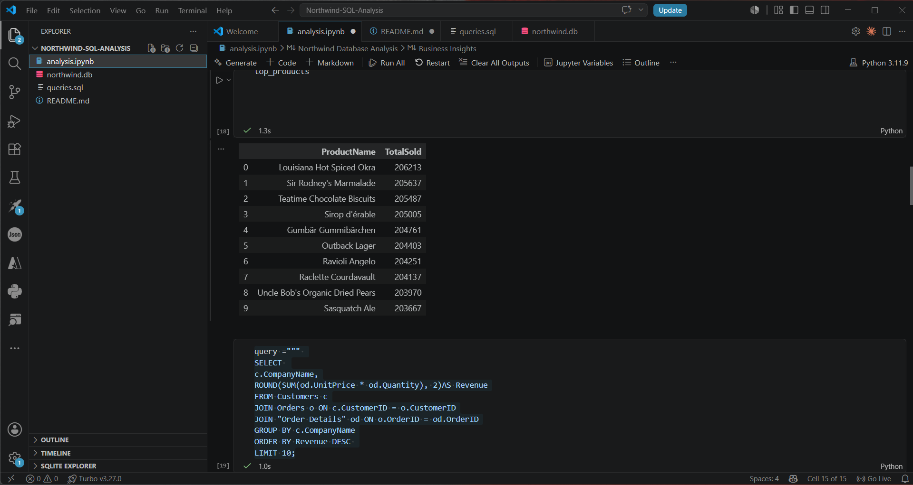
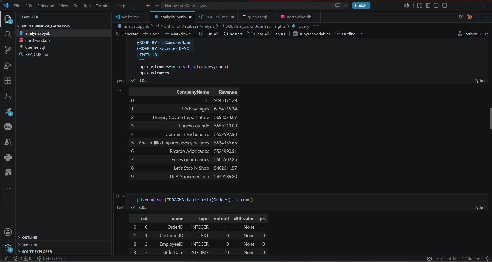
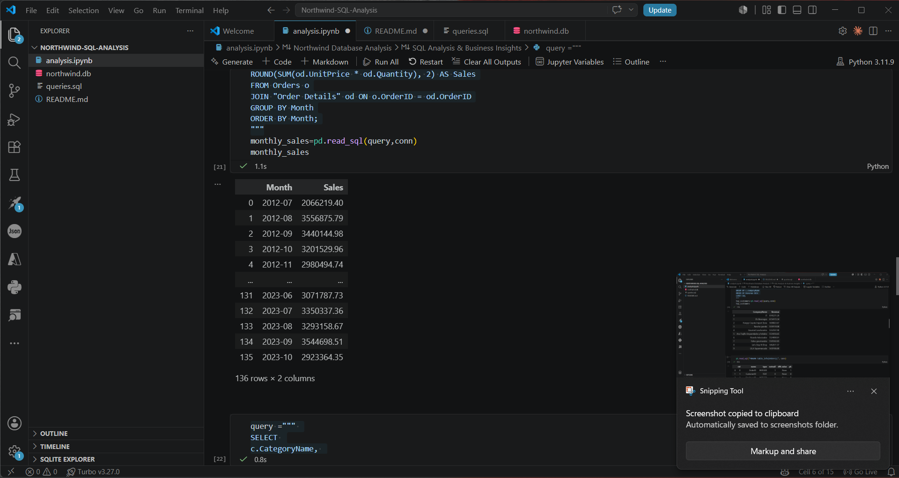
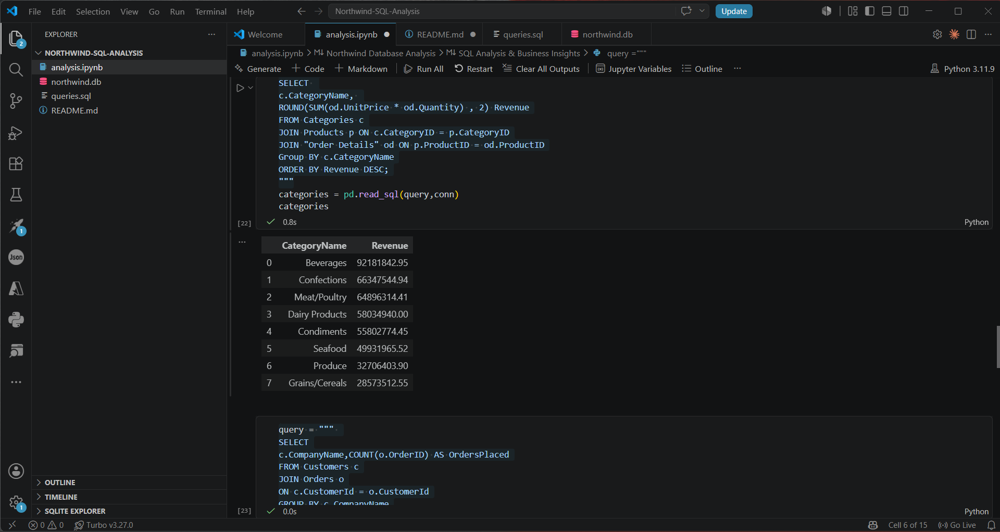
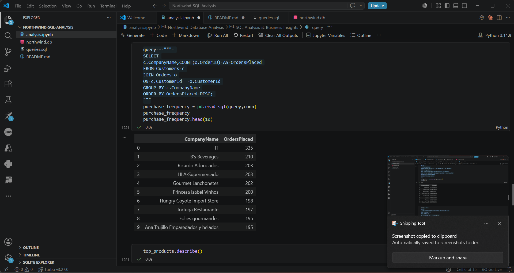

# Northwind Database Analysis

## Database Overview

The Northwind database is a sample business database that represents the operations of a trading company. It contains information about customers, orders, products, categories, suppliers, employees, and shippers. This project uses SQL and Pandas to analyze business performance and generate actionable insights.

---

## Business Questions

1. What are the top 10 selling products?
2. Who are the top 10 customers by revenue?
3. What are the monthly sales trends?
4. Which product categories perform the best?
5. How frequently do customers place orders?

---

## SQL Analysis

The following SQL queries were used:

- Top 10 Selling Products
- Top 10 Customers by Revenue
- Monthly Sales Trends
- Best Performing Product Categories
- Customer Purchase Frequency

> **SQL Output Screenshots:**  
> *(Insert screenshots of your SQL query outputs here after running the notebook.)*

---

## Pandas Analysis

The SQL query results were imported into Pandas for further exploration. Basic exploratory analysis was performed using functions such as:

- `head()`
- `describe()`
- `info()`

This helped summarize the data and identify important business trends.

---

## Business Insights

1. A small number of products contribute significantly to the overall sales volume, making them the primary revenue drivers.

2. A limited group of customers generates a large portion of total revenue, highlighting the importance of customer retention.

3. Monthly sales show fluctuations, indicating that customer demand varies over time and may be influenced by seasonal factors.

4. Some product categories consistently outperform others in terms of revenue, suggesting that these categories deserve greater business focus.

5. Customers who place orders more frequently contribute substantially to total sales, making loyalty programs and personalized marketing valuable strategies.

---

## Files Included

- `queries.sql` – SQL queries used for analysis.
- `analysis.ipynb` – SQL execution and Pandas analysis.
- `README.md` – Project documentation.
- `northwind.db` – SQLite database.

## SQL Output Screenshots

### Top 10 Selling Products

### Top 10 Customers by Revenue

### Monthly Sales Trends

### Best Performing Categories

### Customer Purchase Frequency

